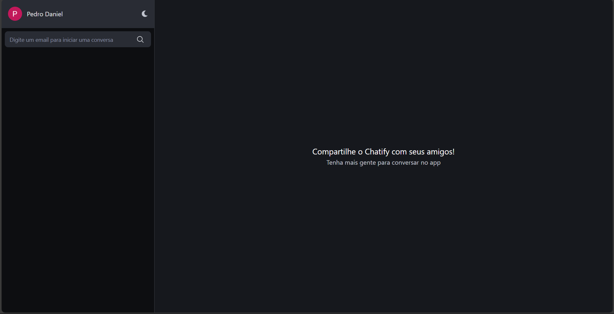

<h1 align='center'>
  Chatify
<br />
<br />
  
</h1>
<br />

## 🧪 Tecnologias
O projeto foi desenvolvido com as seguintes tecnologias:

- [React](https://react.dev/)
- [Typescript](https://www.typescriptlang.org/)
- [Firebase](https://firebase.google.com/)

## 🎯 Objetivo
O Chatify foi criado com o intuito de permitir a comunicação entre pessoas de forma agradável e prática a partir de seus e-mails, sem a necessidade de números de telefone!

## Como executar 
Para iniciar o projeto por conta própria ou modificá-lo, siga os seguintes passos:

```bash
# Faça o clone do projeto
$ git clone https://github.com/pdanmt/Planner

# Entre na pasta criada
$ cd Planner
```
Instale as dependências e inicialize o projeto usando o npm:

```bash
$ npm i

$ npm run dev
```
A aplicação estará rodando no endereço http://localhost:3000/

Além disso, será necessário que você crie um projeto firebase, utilizando do firebase firestore e authentication. Após isso, crie um arquivo .env.local ou .env na raiz do projeto e coloque as configurações do firebase, deste jeito:

```bash
VITE_API_KEY=<SUA_CHAVE>
VITE_AUTH_DOMAIN=<SEU_DOMÍNIO_DE_AUTENTICAÇÃO>
VITE_DATABASE_URL=<A_URL_DO_SEU_BANCO_DE_DADOS>
VITE_PROJECT_ID=<O_ID_DO_SEU_PROJETO>
VITE_STORAGE_BUCKET=<SEU_STORAGE_BUCKET>
VITE_MESSAGING_SENDER_ID=<SEU_MESSAGING_SENDER_ID>
VITE_APP_ID=<O_ID_DA_SUA_APLICAÇÃO>
```